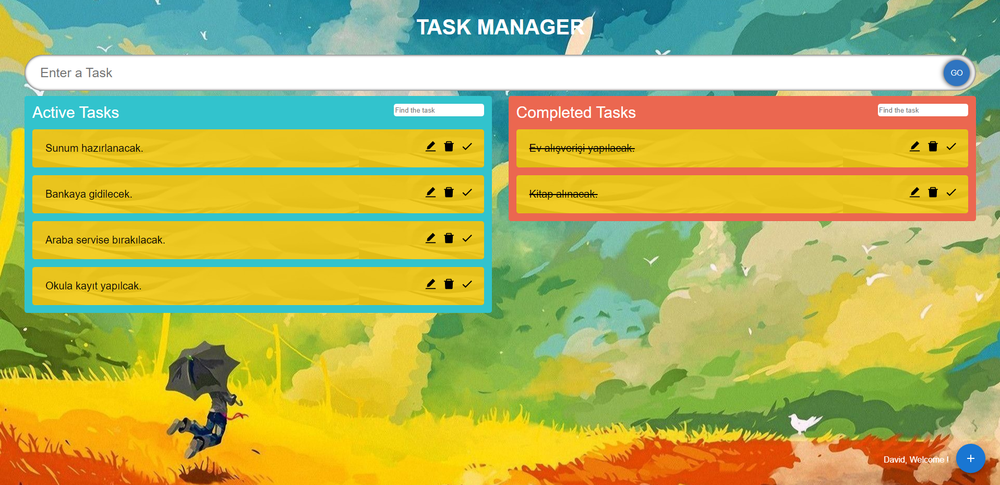

# Task Manager

🔸 Create to-do list that include task, responsibility... <br>
🔸 This web app built with using [React](https://reactjs.org/). <br>
🔸 You can preview [here](https://taskmanager-six.vercel.app/) / id:jack password:123456 /

## 💻 Setup <br>

### Install Dependencies

```
npm install
```

### Run the App in the Dev Server

```
npm start
```

### to Build for Production

```
npm build
```

## 🔥 Technologies and Libraries <br>

✔️ React.js <br>
✔️ TypeScript <br>
✔️ react-beautiful-dnd <br>
✔️ metarial-ui <br>
✔️ react-icons <br>
✔️ react-hook-form <br>

## 📷 Screenshot <hr>


